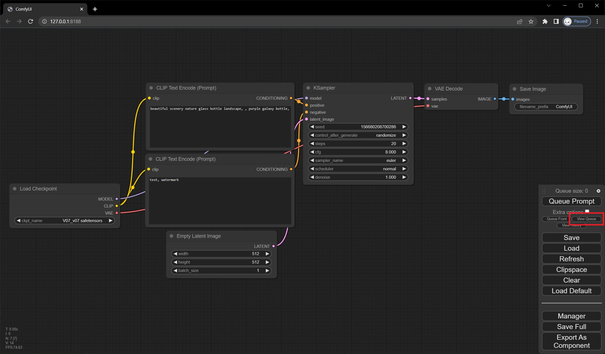
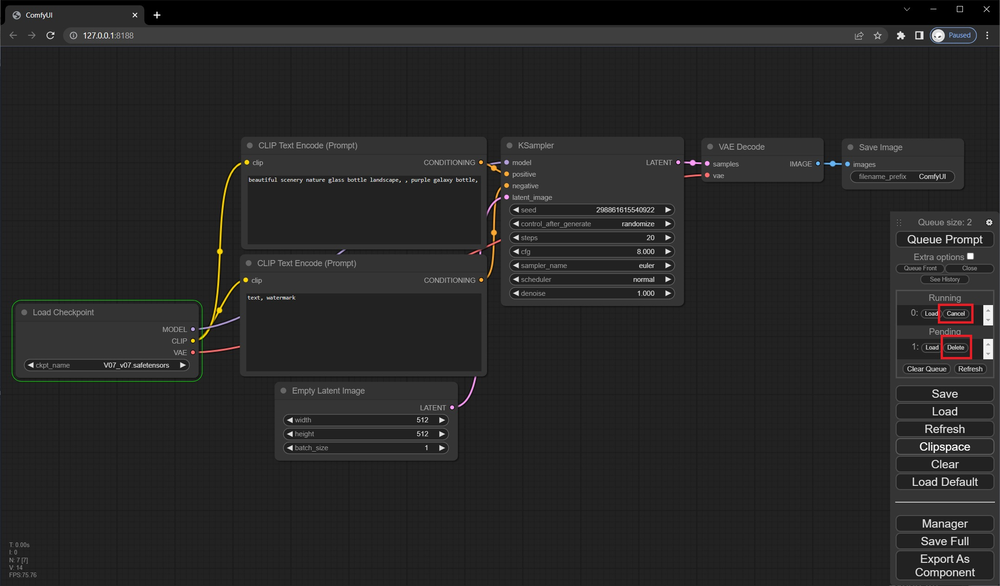
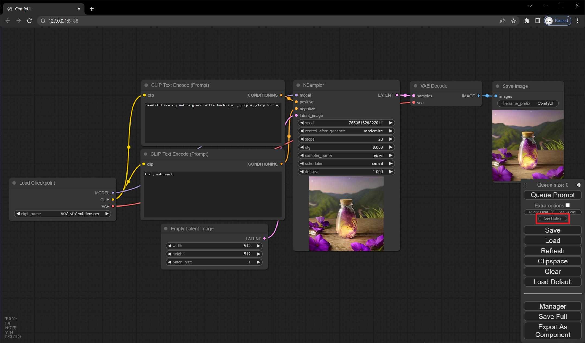
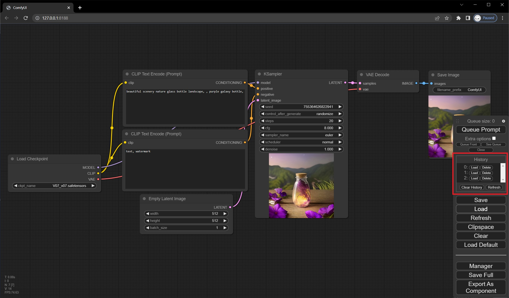
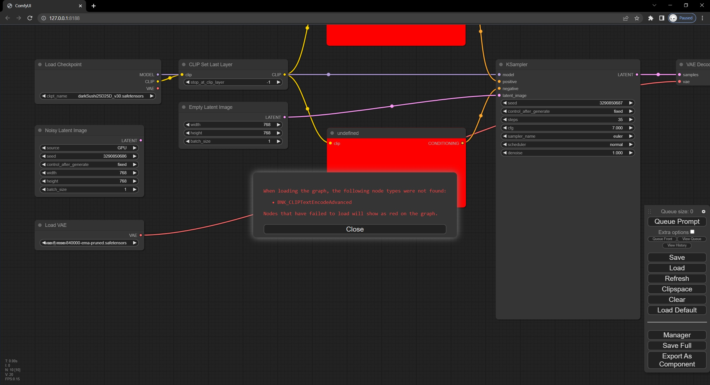
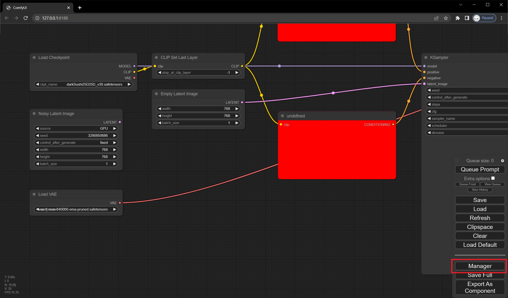
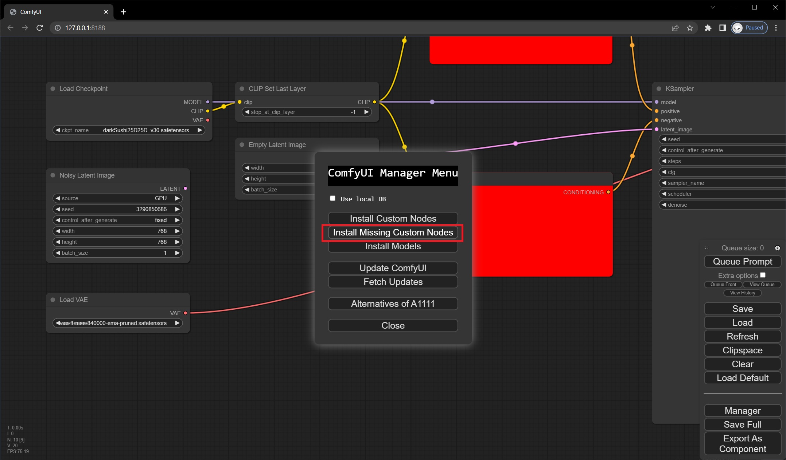
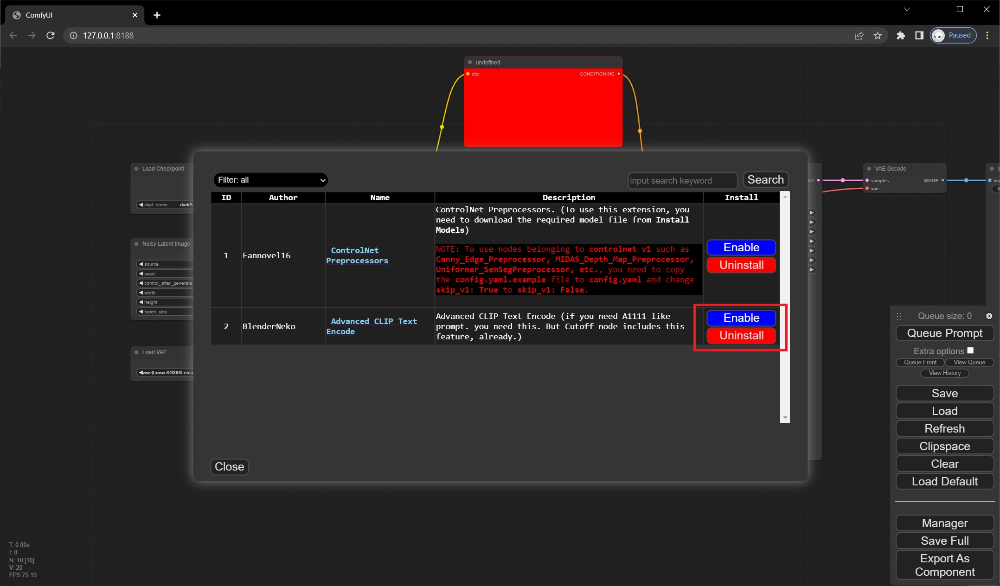
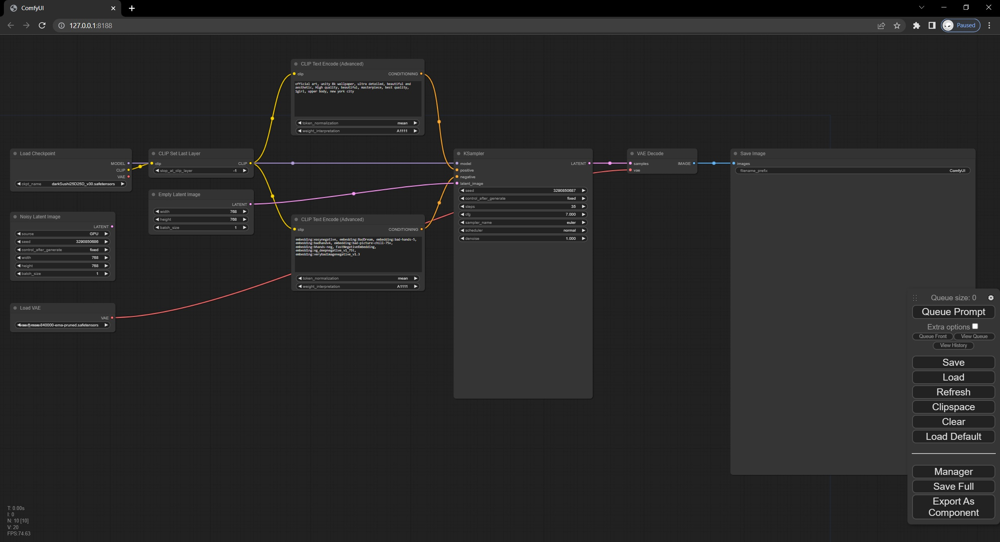
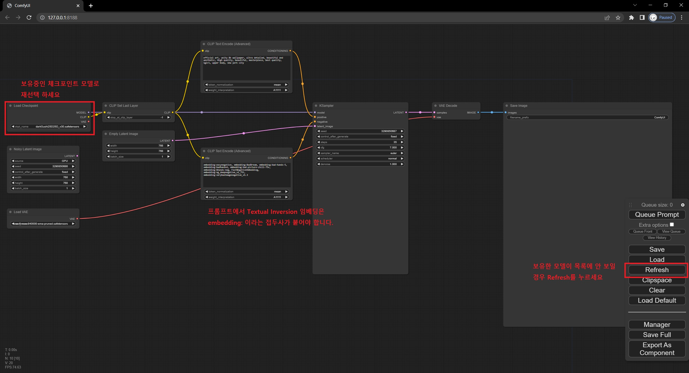

# 기본 실행

### 실행
* prompt 를 입력하고 `Queue Prompt` 를 누르면 이미지가 생성됩니다.
* 간편하게 ctrl-enter 단축키를 이용해서 실행할 수도 있습니다.

### 중지
* 메인메뉴에서 `View Queue`를 누르면, 현재 실행중이거나 대기중인 작업이 나타납니다.

* `pending`(대기중)에서는 delete 를 눌러서 예약을 취소 할 수 있습니다.
* `running`(실행중)에서는 cancel 을 눌러서 실행을 취소 할 수 있습니다.

* *현재 취소에 대한 단축키는 없습니다.*

### 이전 생성물 보기

* 메인메뉴에서 `Show History`를 누르면 이전에 실행했던 작업 결과물을 볼 수 있습니다.

* `Load` 버튼을 누르면 해당 작업물에 대한 워크플로우와 이미지가 보입니다.
* `Delete` 버튼을 누르면 해당 작업 히스토리를 삭제합니다.
  - *작업 내역만 삭제 될 뿐 생성된 이미지가 디스크에서 삭제되지는 않습니다.*

# Workflow 로드하기

* ComfyUI 에서는 워크플로우를 불러오는 2가지 방법이 있습니다.
1. Load 버튼을 눌러서 .json 혹은 SD로 생성한 .png 파일을 로드하기
* .png 파일은 ComfyUI와 A1111 webui 로 생성한 작업물의 프롬프트 모두 로드 가능합니다.

2. .json 혹은 .png 를 드래그 드롭해서 파일 열기

* 위 이미지를 다운 받아 ComfyUI에 드래그 드롭 해보세요.

# Workflow에 없는 커스텀 노드 설치하기

* 위 이미지를 드래그 드롭해서 로드하면, 아마도 아래와 같이 **빨간색 노드**와 함께 오류메시지가 뜰 겁니다. `BNK_CLIPTextEncodeAdvanced` 라는 커스텀 노드가 워크플로우에 사용되었지만 없기 때문에 나타나는 오류입니다.

1. 메인메뉴의 `Manager` 버튼을 눌러 `ComfyUI-Manager` 메뉴를 여세요

2. `Install Missing Custom Nodes` 버튼을 눌러 없는 노드 설치 다이얼로그를 여세요.

3. 다이얼로그가 열리면 이미 설치되었지만 비활성화 되어 있는 경우는 `Enable` 버튼을 눌러 활성화 하면 되고, 설치하지 않은 경우는 `Install` 버튼을 눌러 설치합니다.

4. 필요한 노드의 설치 및 활성화가 모두 완료되었으면, ComfyUI를 재시작 합니다. 
5. **(중요!)** 브라우저를 새로고침 합니다.
* 아래와 같이 워크플로우의 **빨간색 노드**가 모두 사라졌으면, 실행 준비가 거의 다 된 것입니다.

6. 해당 워크플로우에서 사용하고 있는 모델이나 프롬프트를 조정하고 실행합니다.

