# Windows 설치 방법

1. **Portable 버전 ComfyUI**([ComfyUI_windows_portable_nvidia_cu118_or_cpu.7z](https://github.com/comfyanonymous/ComfyUI/releases/download/latest/ComfyUI_windows_portable_nvidia_cu118_or_cpu.7z))를 다운 받으세요
2. 설치 할 위치에 압축을 푸세요

3. **Windows용 ComfyUI-Manager 설치 스크립트**([install-manager-for-portable-version.bat](https://github.com/ltdrdata/ComfyUI-Manager/raw/main/scripts/install-manager-for-portable-version.bat))를 다운 받으세요

* 아래와 같이 run_nvidia_gpu.bat 파일이 있는 위치에 install-manager-for-portable-version.bat 파일을 옮기세요.

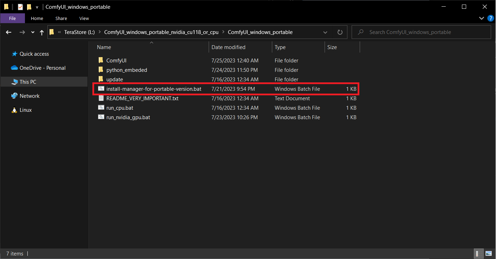

4. install-manager-for-portable-version.bat 를 더블 클릭해서 실행하세요.

### **이미지 생성시 미리보기(preview)를 활성화 하기 위한 선택사항**

1. run_nvidia_gpu.bat 를 메모장으로 여세요.

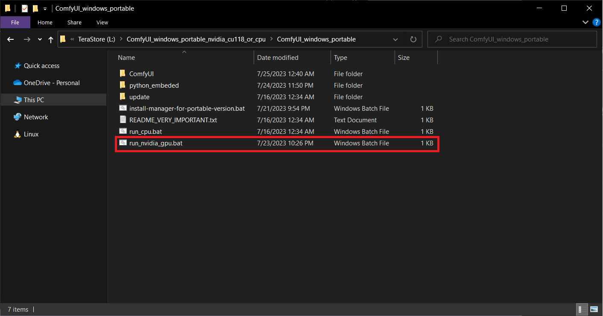

2. `--preview-method auto` 라는 것을 추가적으로 넣어주세요 

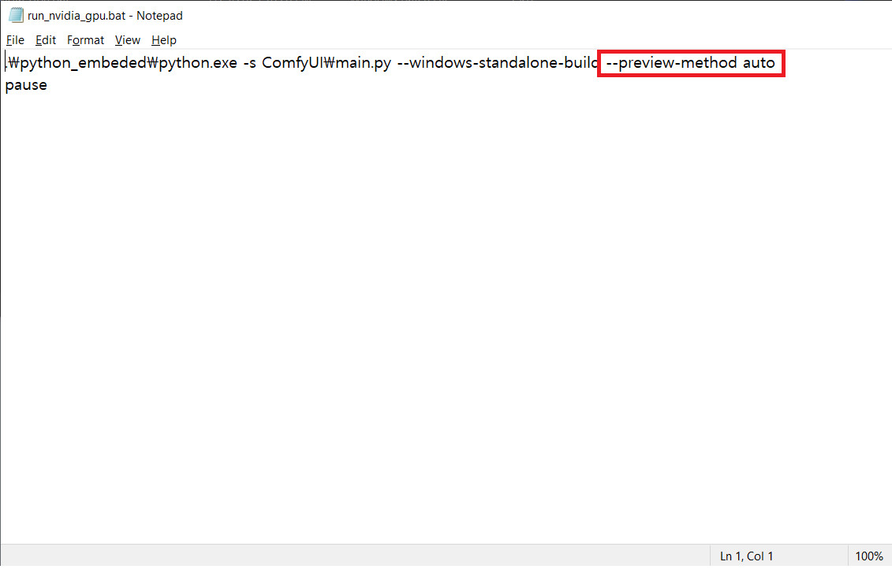

### 실행

* run_nvidia_gpu.bat 를 **더블 클릭**합니다.

# Colab 설치 방법

1. [원클릭 노트북](https://colab.research.google.com/github/ltdrdata/ComfyUI-Manager/blob/main/notebooks/comfyui_colab_with_manager.ipynb) <- 클릭하세요

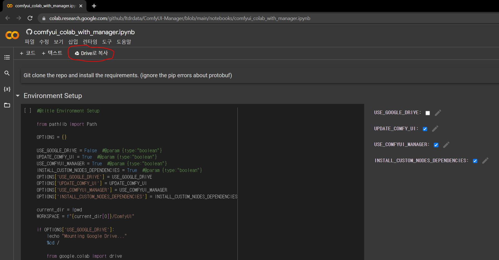

2. **Drive로 복사**를 누르면 새 탭으로 열립니다. (기존의 탭은 닫으세요)

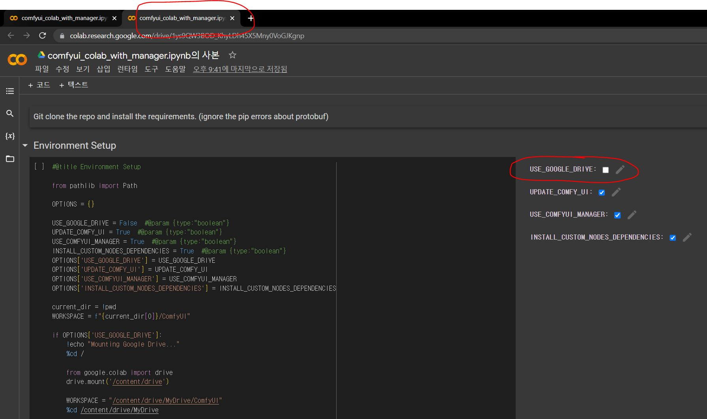

3. **USE_GOOGLE_DRIVE**를 체크하세요 (구글 드라이브를 사용할 경우)

4. 체크를 했으면 Environment Setup 옆의 버튼을 누르세요. **Google Drive에 연결**이 나오면 클릭하고 구글 계정에 로그인하고 동의하고 계속 진행 하면 됩니다. (설치 패키지가 깔리는데 시간이 걸립니다)

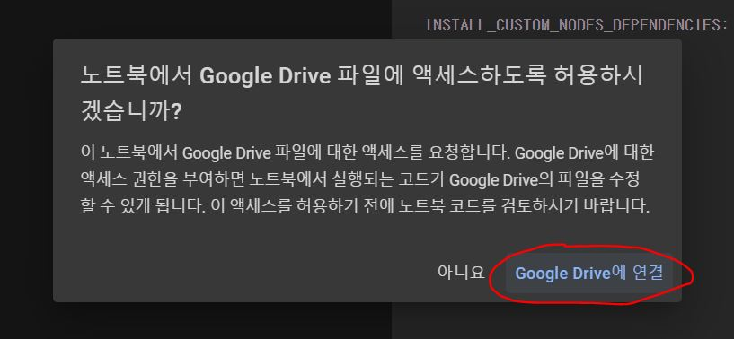

5. **Run ComfyUI with localtunnel** 항목에서 실행 버튼을 누르세요.

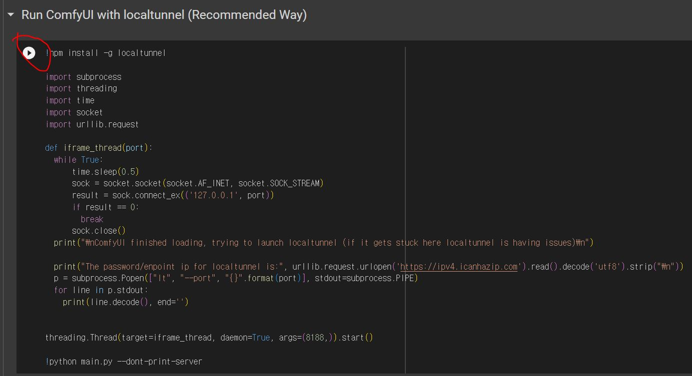

6. 실행이 완료되면 아래와 같은 메시지가 나타납니다. `The password/endpoint ip for localtunnel is` 옆에 써진 숫자를 복사하세요 (**빈칸이 포함되지 않게 주의!**)

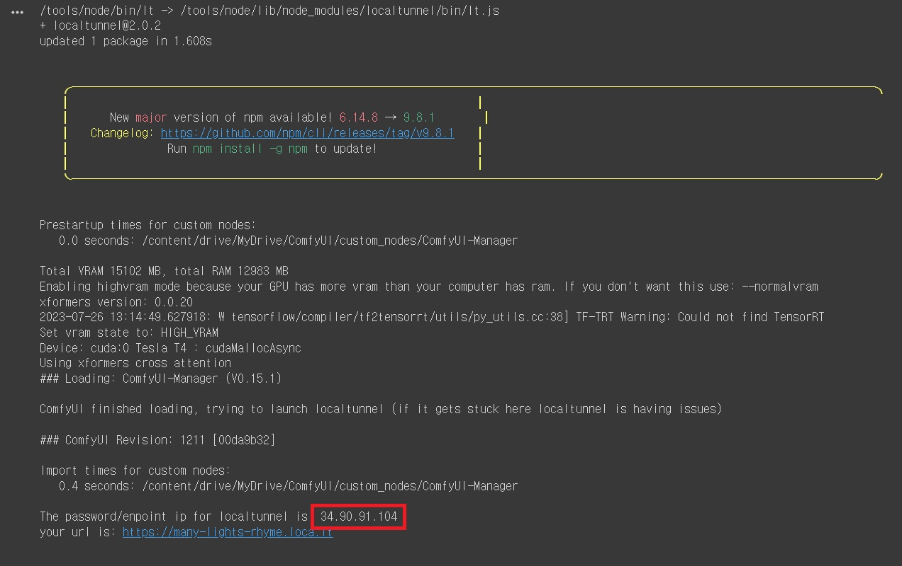

7. your url is: 옆에 있는 주소를 클릭

8. 화면이 열리면 복사한 숫자를 Endpoint IP에 붙여넣으세요.

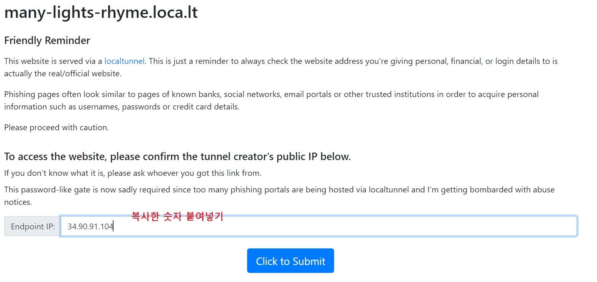

9. Click to Submit 을 누르면 ComfyUI 창이 뜹니다. (localtunnel의 상황에 따라서 로딩이 오래 걸릴 수 있습니다.)

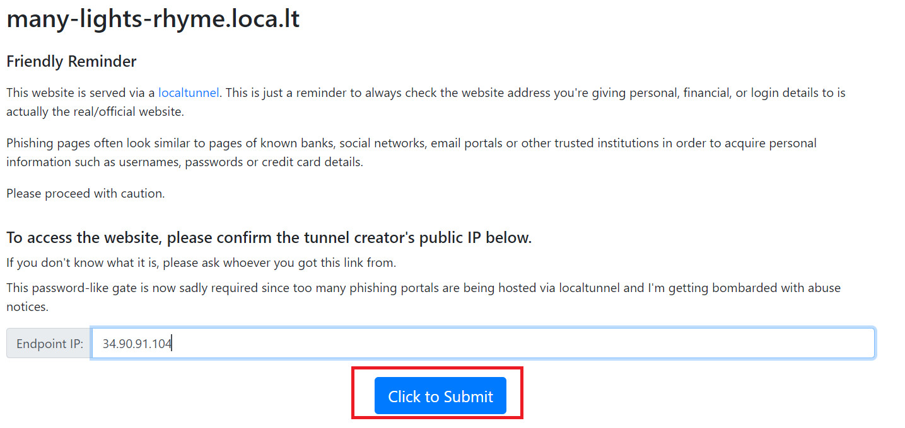

# Linux 에서 venv로 설치 방법

* Ubuntu기준: python-is-python3 및 python3-venv 사전 설치 필요

1. [install-comfyui-venv-linux.sh](https://github.com/ltdrdata/ComfyUI-Manager/raw/main/scripts/install-comfyui-venv-linux.sh) <- 설치할 디렉토리에 다운 받으세요.

2. `chmod +x install-comfyui-venv-linux.sh` 로 실행권한을 부여하고, `./install-comfyui-venv-linux.sh` 로 실행하세요.

## 실행 방법

* 설치가 정상적으로 끝나고 나면 아래와 같이 run_gpu.sh 파일이 생성됩니다. 해당 스크립트를 통해 실행하세요.

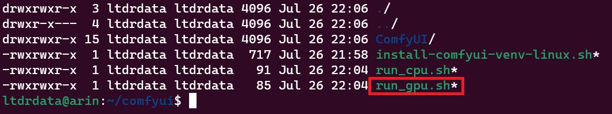

# A1111 webui와 모델 공유 방법

1. ComfyUI 설치 위치에서 `extra_model_paths.yaml.example` 파일을 복사하고 `extra_model_paths.yaml` 로 이름을 바꾸세요.
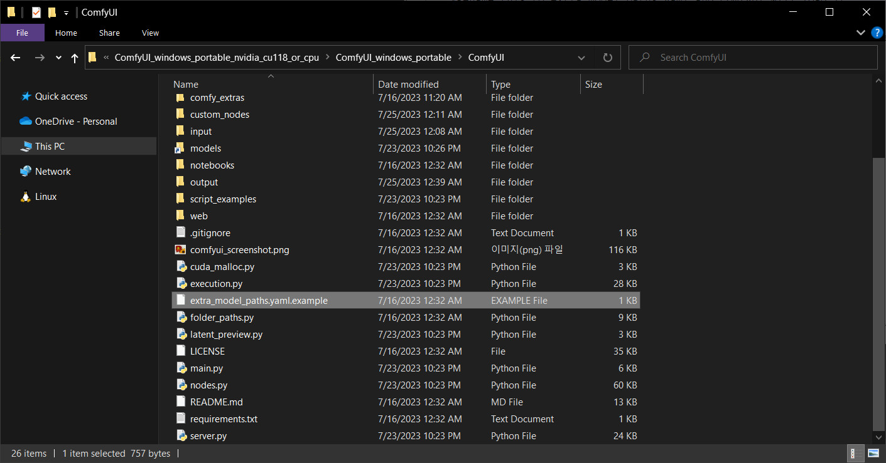
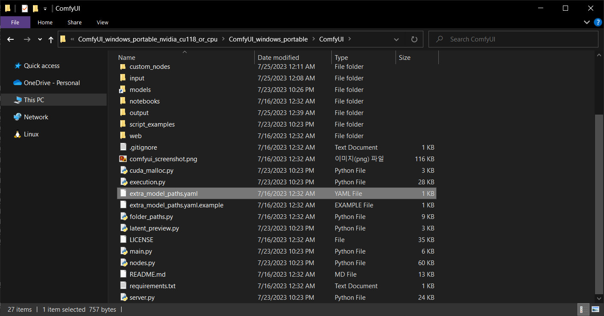

2. `extra_model_paths.yaml` 을 메모장으로 열어서 편집하고 저장하세요.
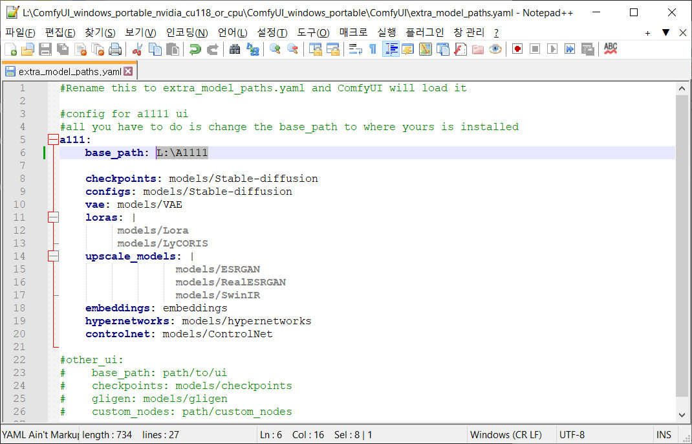

* `base_path` 항목을 A1111 webui 설치 경로로 변경합니다.
* 만약 설치 경로가 `L:\stable-diffusion-webui` 이고 `L:\stable-diffusion-webui\models\Stable-diffusion` 에 체크포인트가 설치된 경우
* `L:\stable-diffusion-webui` 라고 입력하면 됩니다.

3. ComfyUI 를 다시 실행할 때 아래와 같이 모델 경로가 표시되면 정상입니다.
* *해당 편집은 모델 경로를 변경하는 것이 아니라 경로를 추가하는 것입니다.*

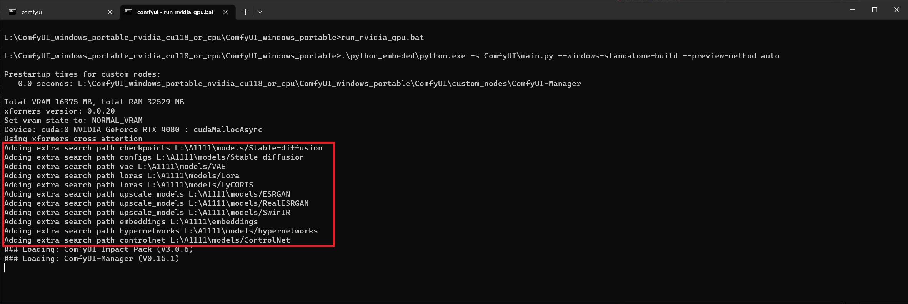