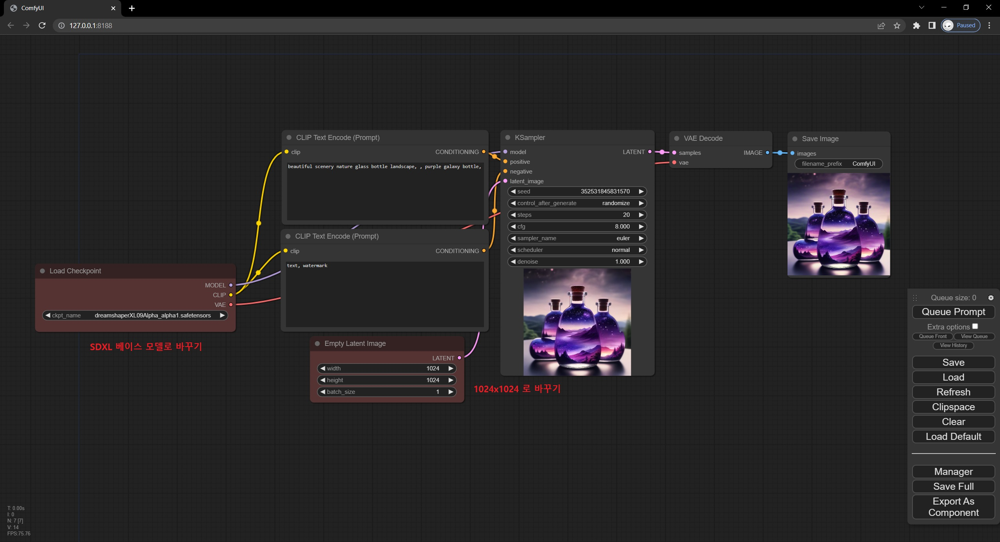
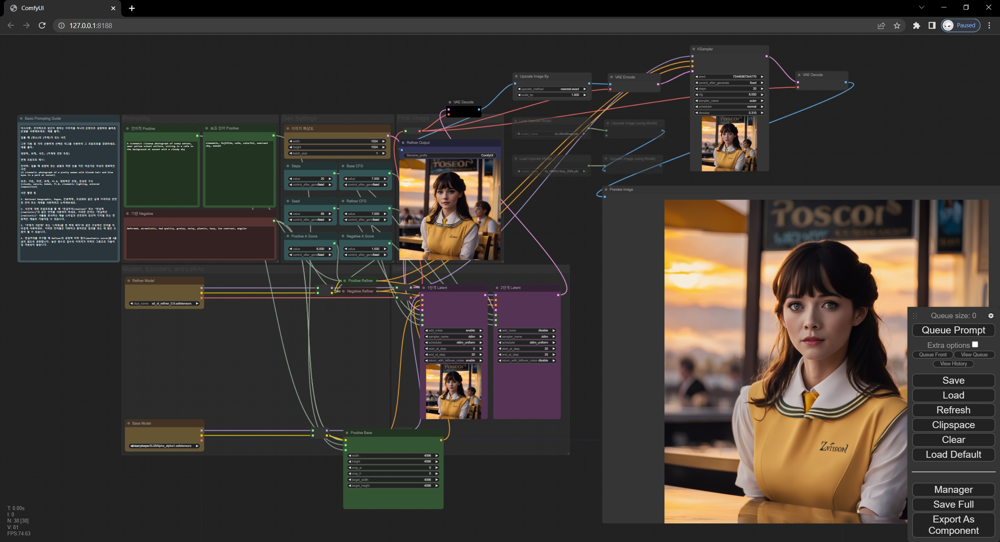
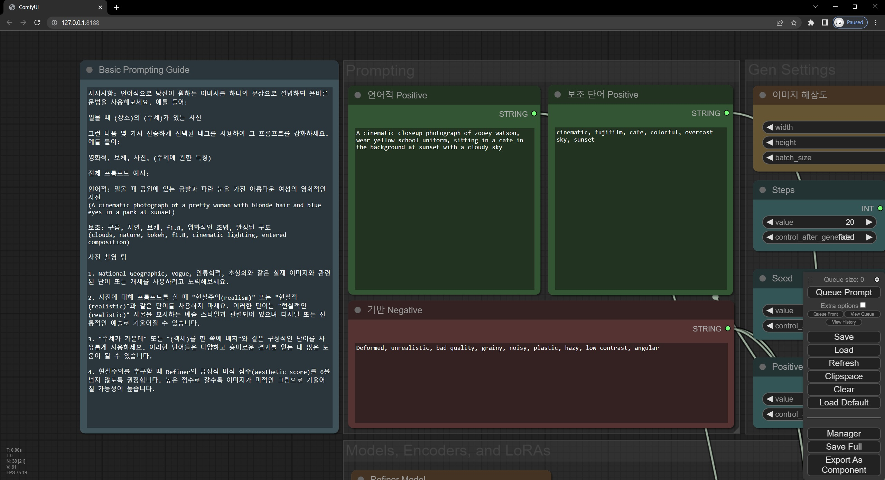
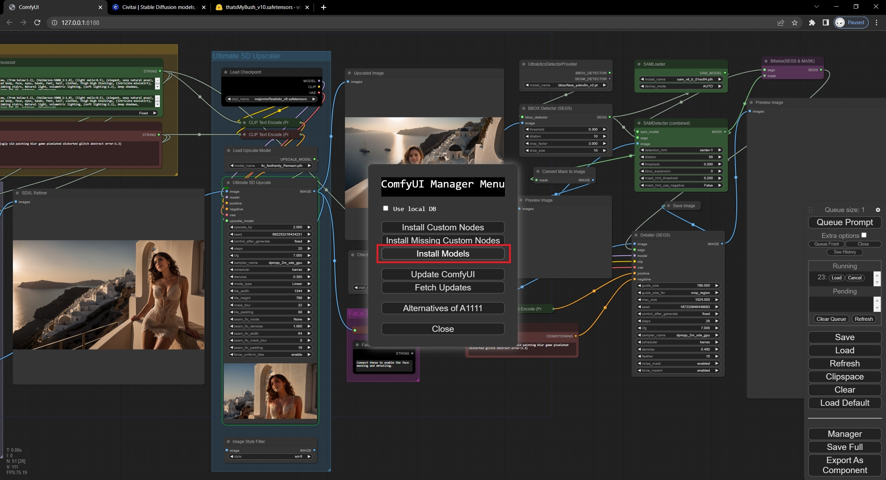
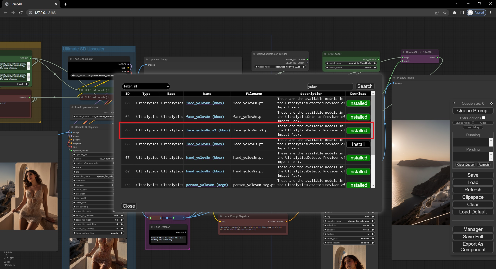

# 무작정 SDXL 이미지 생성해보기

## 기본 워크플로우에서 생성해보기

* 기본 워크플로우에서 단순히 체크포인트만을 바꾸는 것으로도 SDXL 모델로 이미지 생성을 할 수 있습니다.
* 단, SDXL 은 512x512 크기의 이미지로는 학습이 되지 않아 결과물이 좋지 않으므로 1024x1024 로 바꾸는 것을 권장합니다.
* 위 예제에서는 [DreamShaper XL 0.9 Alpha](https://civitai.com/models/112902) 모델을 사용했습니다. 해당 모델은 13GB에 달하는 공식 모델과 달리 6GB 정도로 상대적으로 작은 모델이므로 가벼운 테스트용으로 추천합니다. 곧 공개 될 SDXL 1.0 공식 모델과 SDXL 1.0 기반의 파인튜닝 모델로도 해보세요.

## 고급 워크플로우에서 생성해보기
(*workflow 제작자: Sytan*)

* 아래 이미지를 ComfyUI 로 드래그 드롭 해보세요.이 이미지에 포함 된 Worfklow는 SDXL의 특성을 반영하여 작성된 Workflow 입니다. Base 모델 뿐만아니라 Refiner 모델도 함께 사용되기 때문에, 상당한 메모리를 사용하게 되므로 H/W 사양이 낮은 컴퓨터에서는 실행하기 어려울 수 있습니다.
* 아래 이미지는 [SytanSD](https://github.com/SytanSD/Sytan-SDXL-ComfyUI)의 [Sytan SDXL Workflow v0.5.json](https://github.com/SytanSD/Sytan-SDXL-ComfyUI/raw/main/Sytan%20SDXL%20Workflow%20v0.5.json) Workflow를 기반으로 생성한 것입니다. 아마 SDXL 1.0이 정식으로 공개 될 때 새로운 Workflow가 공개 될 수도 있습니다.
 

* Workflow에 첨부 된 설명을 읽어보면, SDXL의 프롬프트 특성을 이해하는데 도움이 될 수 있습니다.

## SDXL + SD1.5 + Model Upscale + Ultimate SD Upscale을 섞어서 써보기
(*workflow 제작자: galaxytimemachine*)

* 아래 이미지는 [DreamShaper XL 0.9 Alpha](https://civitai.com/models/112902) 모델을 기반으로 1424x800 크기의 이미지를 생성 후, [majicMIX realistic V6](https://civitai.com/models/43331/majicmix-realistic) 모델로 후가공을 하고, [4x_NMKD-Siax_200k.pth](https://huggingface.co/gemasai/4x_NMKD-Siax_200k/resolve/main/4x_NMKD-Siax_200k.pth) 업스케일러로 4배 업스케일 하고, 다시 Ultimate SD Upscale로 2배 업스케일하는 작업을 수행하는 워크플로우 입니다.

* VRAM 에는 한번에 하나의 모델만 로드되지만, RAM에는 위 작업에 사용한 모델들이 모두 로드되기 때문에 충분한 RAM이 부족한 경우 swapping에 의해서 생성 속도가 많이 느려질 수 있습니다.

* [4x_NMKD-Siax_200k.pth](https://huggingface.co/gemasai/4x_NMKD-Siax_200k/resolve/main/4x_NMKD-Siax_200k.pth) 는 upscale_models 에 다운 받으면 사용할 수 있습니다.

* `Ultimate SD Upscaler` 는 커스텀 노드이므로 [기본 가이드](beginner.md)에서 설명한 것과 같이 커스텀 노드를 설치하면 됩니다.

## 그 밖의 실험적인 Workflow
(*workflow 제작자: galaxytimemachine*)

* 아래 이미지는 SDXL + SD1.5 + Ultimate SD Upscale + Wildcard + FaceDetailer 를 적용한 워크플로우입니다.
(galaxytimemachine 은 FaceDetailer 대신에 수작업으로 Detailer 셋팅 작업을 했지만, FaceDetailer를 사용하면 좀 더 간결한 워크플로우를 만들 수 있습니다.)

* Impact Pack이 사용되었으므로 추가적인 커스텀 노드의 설치가 필요합니다. 

* 사용 된 Upscaler: [4x_foolhardy_Remacri.pth](https://huggingface.co/FacehugmanIII/4x_foolhardy_Remacri/resolve/main/4x_foolhardy_Remacri.pth)

* Face Detailer 적용을 위해 face_yolov8n_v2.pt 모델이 사용되었습니다. Manager에서 Install Models로 들어가 설치해야 사용 가능합니다.

