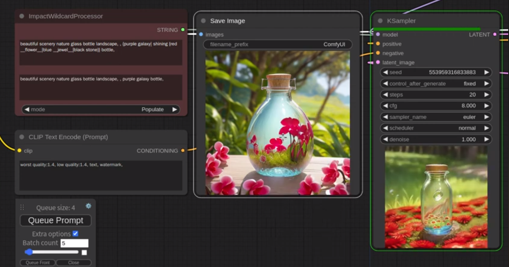
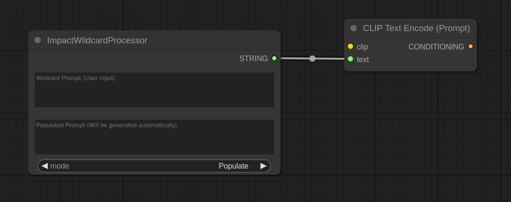
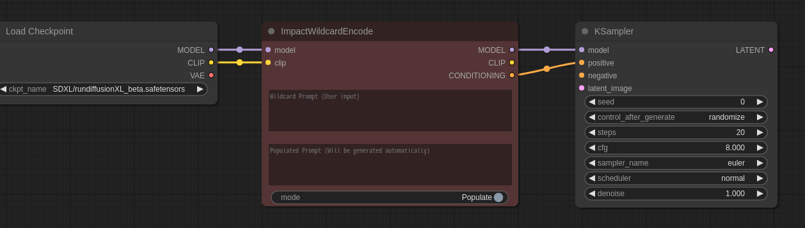
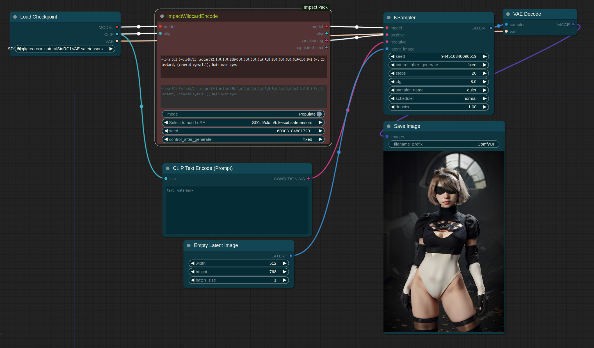
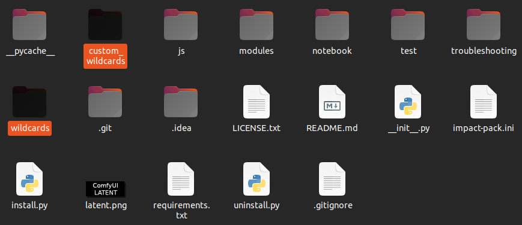
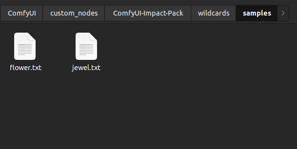
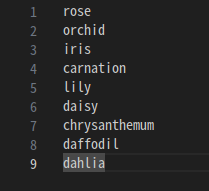

# ImpactWildcardProcessor/ImpactWildcardEncode

The wildcard feature is a functionality that allows random selection from multiple text files described as prompt texts using placeholders like `__flower__`. It assists in choosing and using a random prompt text among the specified files.



You can find the instructions on how to use it in the [YouTube video](https://www.youtube.com/watch?v=joNVYSIzA4k).


## HOW TO USE

### Behavior
* `ImpactWildcardProcessor` is a functionality that operates at the browser level. When running the queue prompt, `ImpactWildcardProcessor` generates the text.
* `ImpactWildcardProcessor` node has two text input fields, but the input using wildcards is only valid in the upper text input box, which is the Wildcard Prompt.
* In the bottom mode settings, there are two options: **Populate** and **Fixed**. When set to Populate, running the queue prompt will process the prompt with wildcards used in the upper Wildcard Prompt section and populate the generated text in the bottom Populated Prompt section.
* In the case of **Populate**, when running the queue prompt, the text generated by the Wildcard Prompt will be entered into the Populated Prompt, and the Populated Prompt will be in a read-only state, where user input is not possible. In the case of **Fixed**, the Wildcard Prompt is ignored, and the Populated Prompt becomes editable, allowing user editing.
* When using `ImpactWildcardProcessor` to generate images, the mode is set to **Fixed**, and the populated text is already entered when the image is saved.
* `ImpactWildcardEncode` is similar to `ImpactWildcardProcessor` but offers the loading functionality of LoRAs. Populated prompts are encoded using the provided clip after all lora loading is completed. All loaded LoRAs are applied to the `model` and `clip` and then returned.





### Syntax
* `ImpactWildcardProcessor` supports two main types of grammar: dynamic prompts using the format `{a|b|c}`, and wildcards using the format `__wildcard__`.
* Dynamic prompts in `ImpactWildcardProcessor` allow nesting, such as `{a|{d|e|f}|c}`, where items separated by | are randomly selected, including nested options.
* If you use a dynamic prompt like `{blue apple|red {cherry|berry}|green melon}`, one option will be randomly selected from the following choices: `blue apple, red cherry, red berry,` or `green melon`.
* If there is a file named `person.txt` inside the wildcards directory, using the wildcard `__person__` will randomly select one item from within that file.
* You can also use compound grammar like `1{girl is holding {blue pencil|red __safruit__|colorful __flower__}|boy is riding __vehicle__}`.
* You can set the selection probability by prefixing a number as in `{5::red|4::green|7::blue|black}`. Each item's selection probability is normalized to 100% based on the sum of all items within the {} brackets, distributing the probabilities evenly.
  - **NOTICE: The selection weight syntax has been updated. Now you should use `{5::red|4::green|7::blue|black}` instead of the previous `{5:red|4:green|7:blue|black}` syntax.**
* The pattern inside `__` is case-insensitive. In other words, `__Jewel__` and `__jewel__` are treated as identical.
* `*` serves as an aggregation pattern, allowing you to group all items from the person path and its wildcard files into one collection, from which you can make selections.
  * Supported in V4.15.1 or above
* Multi-select '$$': Select multiple items from the available choices.
  * {n1-n2$$sel1|sel2|...} - Select between n1 and n2 items from the available choices. If the range exceeds the number of available options, the excess will be ignore d.
  * {-n$$sel1|sel2|...} - Select between 1 and n items.
  * {n$$sel1|sel2|...} - Select n items.
  * custom seperator
    * {n$$ and $$sel1|sel2|...} - Select n items using ' and ' as a separator.
    * {n1-n2$$ or $$sel1|sel2|...} - Select between n1 and n2 items using ' or ' as a separator.

### Special Syntax for Detailer Wildcard
* Start the prompt by placing `[ASC]`, `[DSC]`, `[RND]`, `[LAB]`, `[CONCAT]` at the very beginning.
  - ASC: Ascending order
  - DSC: Descending order
  - RND: Random
  - LAB: label
    - `[ASC]`, `[DSC]`, `[RND]` denotes the order of SEGS' bboxes. The left of the bbox takes precedence as the primary criterion, and the top is the secondary criterion.
  - CONCAT: Instead of replacing the **positive conditioning** with the **wildcard_opt**, Concatenate the wildcard conditioning with the positive conditioning using the `Conditioning Concat`.

  **e.g.**
  ```
  [ASC]
  1girl, blue eyes, smile [SEP]
  1boy, brown eyes [SEP]
  ```

  - `[LAB]` is based on the application according to labels. Each label can appear only once, and `[ALL]` functions as a prefix.

  **e.g.**
  ```
  [LAB]
  [ALL] laugh, detailed eyes
  [Female] blue eyes
  [Male] brown eyes
  ```

  **e.g.**
  ```
  [CONCAT]detailed eyes, faint smile face
  ```

### Lora Block Weight support
* If the [Inspire Pack](https://github.com/ltdrdata/ComfyUI-Inspire-Pack) is installed, you can use Lora Block Weight in the form of `LBW=lbw spec;`. If the `Inspire Pack` is not installed, this spec will be ignored.
* "The 'spec' within `LBW=spec` internally uses semicolons (;) as separators.". It is recommended to end the LBW spec definition with a semicolon (;). If it ends without a semicolon, specifying the weight afterward may result in a specification error.
* Specs that come after `LBW=` without `A=` or `B=` are applicable for use in the `Inspire Pack`'s `Lora Loader (Block Weight)` node. Specs provided with `A=` or `B=` are inputted as parameters for the `A` and `B` parameters of the `Lora Loader (Block Weight)` node.
  * For detailed information about LBW, please refer to this [link](https://github.com/ltdrdata/ComfyUI-extension-tutorials/blob/Main/ComfyUI-Inspire-Pack/tutorial/LoraBlockWeight.md).
* EX) 
  * `<lora:chunli:1.0:1.0:LBW=B11:0,0,0,0,0,0,0,0,0,0,A,0,0,0,0,0,0;A=0.;>`
  * `<lora:chunli:1.0:1.0:LBW=0,0,0,0,0,0,0,0,0,0,A,B,0,0,0,0,0;A=0.5;B=0.2;>`
  * `<lora:chunli:1.0:1.0:LBW=SD-MIDD;>`




### Application
* If you use wildcards with files, you can save frequently used prompts in a file and load them for usage. For example, if you have a line composed of `photorealistic:1.4, best quality:1.4` and save it as `ppos.txt` in the custom_wildcards directory, you can create prompts in a concise form like `__ppos__`, beautiful nature.

## SETUP
* Under the ComfyUI-Impact-Pack/ directory, there are two paths: custom_wildcards and wildcards. Both paths are created to hold wildcards files, but it is recommended to avoid adding content to the wildcards file in order to prevent potential conflicts during future updates.



* The wildcard supports subfolder feature.
  * For example, if there is a wildcard file named `custom_wildcards/obj/person.txt`, it should be used as `__obj/person__` instead of `__person__`.
  * NOTICE: The subfolder feature was not supported in older versions. The subfolder feature is a newly updated functionality.



* `.yaml` wildcards file supports. (V4.18.4)
  * You can download and use [Wildcard YAML](https://civitai.com/models/138970/billions-of-wildcards-all-in-one) files in this format.
  * For example, if a YAML file is structured like the following, you can use `__astronomy/Celestial-Bodies__` and `__surface-swap__` as wildcards, and one of the item inside can be chosen.
  ```
  astronomy:
    Celestial-Bodies:
        - Star
        - Planet
        ...
  surface-swap:
      - swap the surfaces for
      - replace the surfaces with        
      ...
  ```

* Within the wildcard, the items to be randomly selected should be placed one per line.
* If items are entered on a single line separated by commas, the entire line will be considered as one item.
* Below is the content of the file flower.txt. If written as follows, using `__flower__` in the prompt text will randomly select one from `rose, orchid, iris, carnation, lily, daisy, chrysanthemum, daffodil, and dahlia`.




