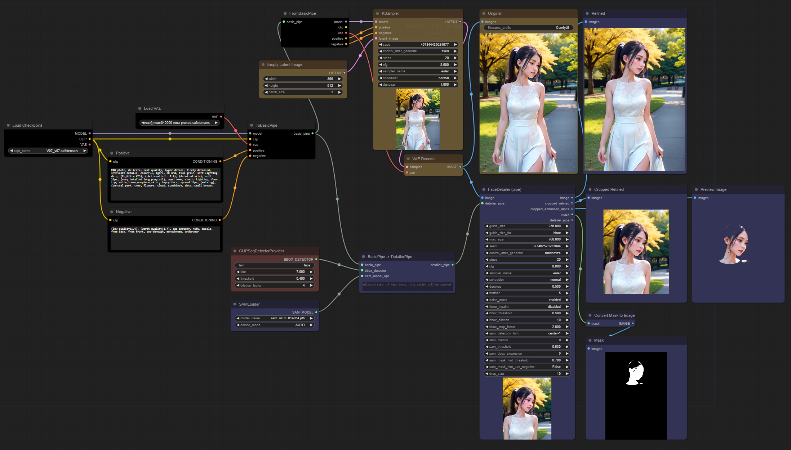

#### 1. CLIPSeg application

 

* Prerequisite: [ComfyUI-CLIPSeg](https://github.com/biegert/ComfyUI-CLIPSeg) custom node. 
* CLIPSegDetectorProvider is a wrapper that enables the use of CLIPSeg custom node as the BBox Detector for FaceDetailer.
    * Convert the segments detected by CLIPSeg to a binary mask using ToBinaryMask, then convert it to MaskToSEGS and supply it to FaceDetailer.
* To use CLIPSegDetectorProvider for FaceDetailer, please input "face" as the prompt for the wrapper.
* Set "mask-point-bbox" as the value for sam_detection_hint. 
* This node can be useful when detecting faces of difficult styles that are hard to detect with MMDet models, or when detecting non-face parts as text and improving them. 