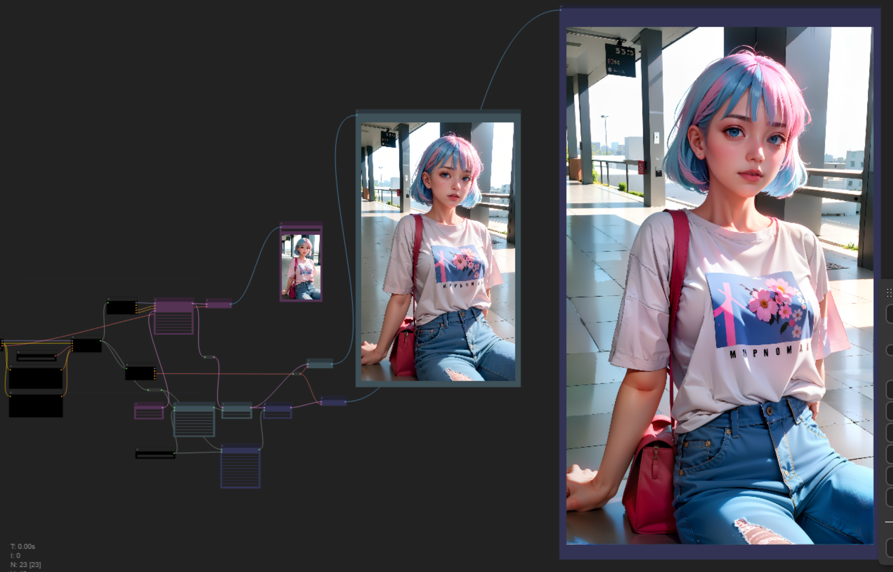

## Extreme Highresolution Upscale

* Using PixelTiledKSampleUpscalerProviderPipe can help avoid VRAM shortage issues. Here, we reduced the number of steps to quickly obtain results, but to achieve a more natural result, it is necessary to increase the number of steps.
* To use PixelTiledKSampleUpscalerProviderPipe, you need BlenderNeko's [ComfyUI_TiledKSampler](https://github.com/BlenderNeko/ComfyUI_TiledKSampler) extension.

