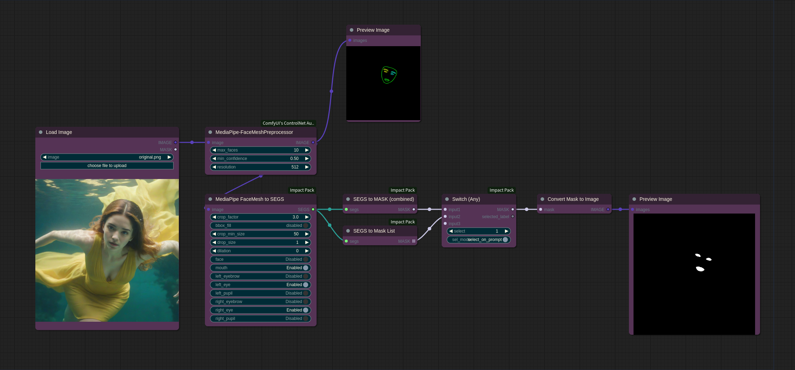

## MediaPipe FaceMesh to SEGS

The `MediaPipe FaceMesh to SEGS` node is a node that detects parts from images generated by the `MediaPipe-FaceMesh Preprocessor` and creates SEGS.

NOTE: The image used as input for this node can be obtained through the `MediaPipe-FaceMesh Preprocessor` of the [ControlNet Auxiliary Preprocessor](https://github.com/Fannovel16/comfyui_controlnet_aux).

* crop_factor - This parameter determines how many times larger an area to crop compared to the detected parts.
* crop_min_size - This setting configures the minimum size for cropping. Since part detection is usually quite small, using just the `crop_factor` may not provide a sufficient size for use in more detailed applications.
* drop_size - Any parts detected smaller than this size will be dropped.
* dilation - The detected mask area is dilated. In the case of features like pupils, where the mask is generated at a nearly point level, this option is necessary to create a sufficient mask for inpainting.
* face, mouth, left_eyebrow, left_eye, left_pupil, right_eyebrow, rigth_eye, right_pupil - This setting configures the detection status for each facial part. You can set it here to detect all parts and then use the SEGS Filter node to filter the detected SEGS as needed.

## MediaPipe FaceMesh Detector Provider

* This node is provided by the [Inspire Pack](https://github.com/ltdrdata/ComfyUI-Inspire-Pack) and requires the installation of Impact Pack and [ControlNet Auxiliary Preprocessors](https://github.com/Fannovel16/comfyui_controlnet_aux) to be used.
* It's a wrapper node that makes the detection model available for use in `FaceDetailer` or `Detector` within the Impact Pack.