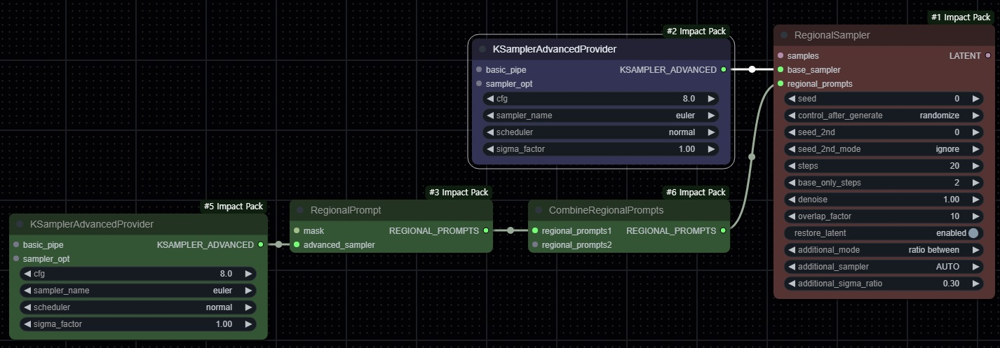

# Regional Sampler

## Basic

The Regional Sampler is a special sampler that allows for the application of different samplers to different regions. Unlike the TwoSamplersForMask, which can only be applied to two areas, the Regional Sampler is a more general sampler that can handle n number of regions. The Regional Sampler is a powerful sampler that allows for different controlnet, prompt, model, lora, sampling method, denoise amount, and cfg to be set for each region. However, it is easier to lose harmony compared to other regional methods.

It is strongly recommended to use it with controlnet to fix the composition. If regional sampling is performed in a composition that deviates from the region, a blurry image is obtained because each region is denoised with a prompt that does not fit the target area.

The technical details of how the Regional Sampler works are as follows:

1. The part set as a region from the entire image area is set as the base region excluding the mask.
    * At this time, the base region's mask invades the region mask by the `overlap_factor`, creating an overlapping area. This prevents artifacts from being created at the boundary of the region mask.
2. Base only sampling stage
    * The entire area is sampled with the `base_sampler` for the `base_only_steps`.
    * This option is used to set a stable initial composition.
3. Regional sampling stage
    * After base only sampling, the following actions are performed for denoising the region and base for each sampling step.
        2-1. Perform base region sampling with the `base_sampler`
            * This mitigates the phenomenon of boundaries appearing between regions.
        2-2. Perform sampling with the sampler set in the `regional_prompt` for each region
4. After all sampling is completed, additional sampling is performed for the base region.

The input is configured as follows:

* `samples`: It is a latent input, just like KSampler.
* `base_sampler`: It is a sampler applied to the remaining area, i.e., the base region, which is not set as a region.
* `regional_prompts`: It is an input that bundles the model and conditioning and sampler to be applied to each region.
    * You can connect any number of `regional_prompts` bundled through the `CombineRegionalPrompts` node to this input.

Each widget is configured as follows:

* `seed`: It is a noise seed that is basically applied.
* `seed_2nd`: It is a setting value for additional noise seed to be applied.
* `seed_2nd_mode`: It is the application method of seed_2nd.
    * **ignore**: Do not use seed_2nd.
        * In the base only sampling stage, the seed is applied as a noise seed, and in the regional sampling stage, denoising is performed as it is without additional noise.
    * Others: In the base only sampling stage, the seed is applied as a noise seed, and once it is closed so that there is no leftover noise, new noise is added with **seed_2nd** and the regional samping stage is performed.
        * **fixed**: Use `seed_2nd` as it is as an additional noise seed.
        * **seed+seed_2nd**: Apply the value of `seed+seed_2nd` as an additional noise seed
        * **seed-seed_2nd**: Apply the value of `seed-seed_2nd` as an additional noise seed
        * **increment**: Not implemented yet. Same with **fixed**.
        * **decrement**: Not implemented yet. Same with **fixed**.
        * **randomize**: Not implemented yet. Same with **fixed**.
* `steps`: Total sampling steps
* `base_only_steps`: Number of steps to be applied in the base only sampling stage. It is used to set a stable initial composition without regional sampling.
* `denoise`: Denoise amount
* `overlap_factor`: The size of the base mask invading the region mask. It is calculated by eroding the region mask by the `overlap_factor`.
* `restore_latent`: When each regional sampling is performed, noise also occurs outside the region mask. If `restore_latent` is set to **enabled**, every time each regional sampling step is completed, the area outside the mask is restored to the latent created by base sampling.
* `additional_mode`: 
    **..._sde** or **uni_pc** and other special samplers are used, the region is not properly denoised, and it causes a phenomenon that destroys the overall harmony. To compensate for this, a recovery operation is performed using another sampler. This requires a longer time for sampling because a second sampling is performed at each step in each region using a special sampler.
    * **DISABLE**: Disable this feature.
    * **ratio additional**: After performing the denoise amount to be performed in the step with the sampler set in the region, the recovery sampler is additionally applied by the `additional_sigma_ratio`. If you use this option, the total denoise amount increases by `additional_sigma_ratio`.
    * **ratio between**: The denoise amount to be performed in the step with the sampler set in the region and the denoise amount to be applied to the recovery sampler are divided by `additional_sigma_ratio`, and denoise is performed for each denoise amount. If you use this option, the total denoise amount does not change.
* `additional_sampler`:
    * **AUTO**: Automatically set the recovery sampler.
        * If the sampler is **uni_pc, uni_pc_bh2, dpmpp_sde, dpmpp_sde_gpu**, the **dpm_fast** sampler is selected
        * If the sampler is **dpmpp_2m_sde, dpmpp_2m_sde_gpu, dpmpp_3m_sde, dpmpp_3m_sde_gpu**, the **dpmpp_2m** sampler is selected
    * Others: Manually set the recovery sampler.
* `additional_sigma_ratio`: It is the ratio of denoise amount to be applied according to `additional_mode`.

## regional prompts

The basic composition of regional prompts in the Impact Pack is as follows:

The Inspire Pack provides a node that integrates various stages of regional prompts creation, making it easy to set up regions.

![sample!-inspire][https://github.com/ltdrdata/ComfyUI-extension-tutorials/blob/Main/ComfyUI-Inspire-Pack/workflow/regional-sampling.png]

## img2img

## sigma factor

`sigma_factor` is a function that adjusts the denoise amount set for each region.

denoise, steps, and scheduler determine what is called a noise schedule, sigma. The noise scheduler is the amount of denoise at each step.
`sigma_factor` is multiplied by the amount of denoise at each step to change the denoise amount.

* 1.0: No effect
* Less than 1.0: Decreases denoise, resulting in lower denoise than the Regional Sampler
* More than 1.0: Increases denoise, resulting in higher denoise than the Regional Sampler

