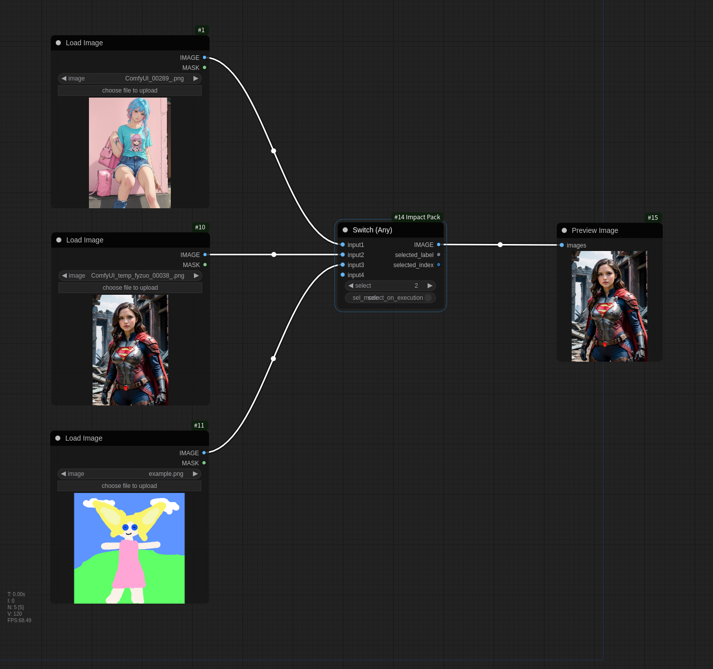

# Switch (Any) / InversedSwitch (Any)

## Switch (Any)

This node is used to select one output from multiple inputs when executing a workflow.

* It receives multiple `input?` inputs and outputs a single one selected by `select`.
* `input?` can be of any type, and the output type is determined by the input type.

## InversedSwitch (Any)

This node is used to select and execute different types of sub-workflows for a single input.

* It can connect multiple output lines for a single input, and only outputs through the one selected by `select`.
* `input` can be of any type, and the type of `output?` is determined by the type of `input`.
* When using `ComfyUI v0.1.0` and `Impact Pack v7.2` or later versions, if it is `select_on_execution` mode, you can control the execution path of the workflow dynamically.

## sel_mode

* `select_on_prompt`: Determines the selection by `select` statically before the workflow is executed. (**for legacy**)
    * This method must be used in ComfyUI versions prior to v0.1.0 due to limitations in dynamically changing the workflow execution structure.
    * It operates by virtually disconnecting node connections before the workflow is executed.
    * In this mode, connecting node outputs other than ImpactInt or Primitive nodes to the `select` input will cause malfunction.
    * In the following workflow, you can selectively execute a workflow using either Canny or OpenPose Pose depending on the select value.

* `select_on_execution`: Determines the selection by `select` dynamically during workflow execution.
    * This works properly only in ComfyUI versions after Aug. 16, 2024 (v0.1.0). Earlier versions will generate errors due to execution structure limitations.
    * In this mode, you can connect any integer output node to the `select` input.
    * When using this mode with an `Inversed Switch` - `Switch (any)` structure for execution, you should be aware of the following:
        * `Inversed Switch` sends an ExecutionBlocker signal to stop execution on the unselected outputs.
        * `Switch (any)` only requests execution for the selected input among its inputs.
        * However, if an unselected output from `Inversed Switch` is connected to an output node other than `Switch (any)` (such as PreviewImage), it will attempt to execute forcibly, regardless of `Switch (any)`.
        * In this case, the execution stop signal of ExecutionBlocker is transmitted transitively, causing the execution of the `Switch (any)` node to stop as well.
        * In other words, for proper execution control, output nodes in the sub-workflow between `Inversed Switch` and `Switch (any)` should be removed (or muted) as shown below.
        * (Note) PreviewBridge is an output node because it can be an endpoint node, even though it has an output.

