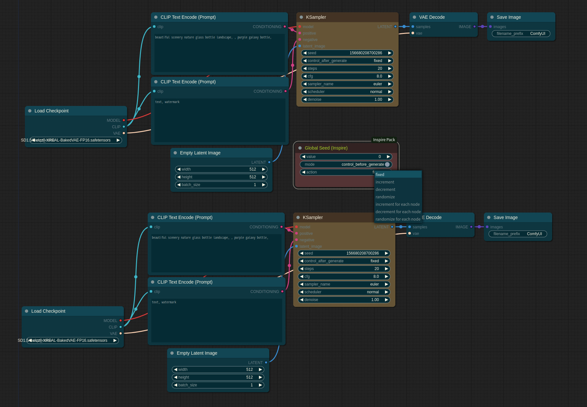

## GlobalSeed

This tutorial is provided as [Tutorial Video](https://www.youtube.com/watch?v=gmmuToLuAO8).

* The `GlobalSeed` node controls the values of all numeric widgets named 'seed' that exist within the workflow.
* `GlobalSeed` does not require a connection line. (This is a **REMOTE** controller!!!)
* When set to `control_before_generate`, it changes the seed before starting the workflow from the queue prompt.
* When the action is set to `increment`, `decrement`, or `randomize`, it modifies the value of `GlobalSeed` and applies the same value uniformly to the seeds of all nodes.
* When the action is set to `increment for each node`, `decrement for each node`, or `randomize for each node`, it modifies the value of `GlobalSeed` and distributes it to each node's seed value according to the action, spreading the changes across all seeds value.

* If you want to exclude a specific seed widget from the influence of `GlobalSeed`, convert it to an input and connect it to the `PrimitiveNode`.
* If you want to temporarily pause the control of `GlobalSeed`, mute the `GlobalSeed` node.

* NOTICE: When the seed widget of each node is not set to 'fixed,' `GlobalSeed`'s value is applied correctly, but on the screen, it is overridden by 'randomize', making the applied seed not visible. However, it is reflected when you load the generated workflow.
