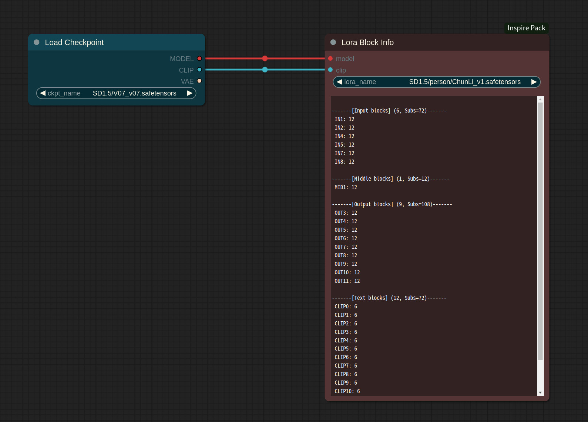
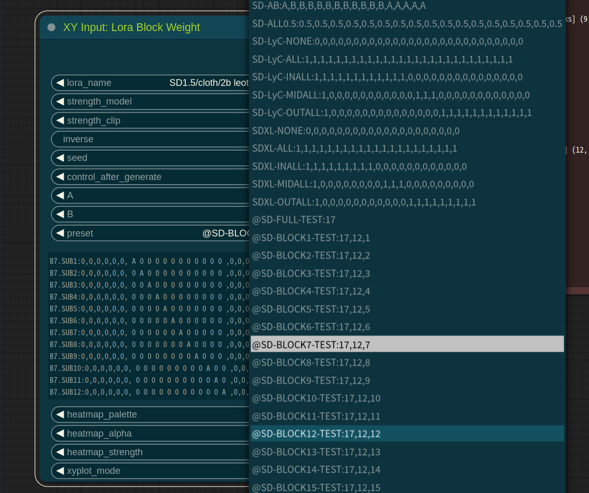

# Lora Block Weight

This tutorial is provided as [Tutorial Video](https://www.youtube.com/watch?v=X9v0xQrInn8).

# Basic
* Lora Block Weight is used to attenuate the influence of certain features in the model when loading LoRA, allowing you to reflect specific characteristics of LoRA. By blending multiple LoRAs using this node, you can mitigate the degradation in image quality.

* When using Lora Block Weight to partially block certain blocks within Lora, the effects can vary from one model to another. Therefore, it's necessary to analyze the effects using nodes like XYPlot and others.
(Note: To use this feature, update `Efficient Nodes` to a version released after September 3rd.)

* It is similar to [sd-webui-lora-block-weight](https://github.com/hako-mikan/sd-webui-lora-block-weight) but offers some modified features.
    * Instead of X, you can use two variables, A and B.
    * a and b are each half of the values of A and B, respectively.
    * U, u, R, and r are randomized values applied based on the seed. U and u are random values within the range of 0 to 3.0, while R and r are random values within the range of -1.5 to 1.5.
    
* The preset file is located under ComfyUI-Inspire-Pack/resources.
    * You can copy the `lbw-preset.custom.txt.example` file to `lbw-preset.custom.txt` and edit it to use custom user presets.
    * Note: Do not modify `lbw-preset.custom.txt.example` and `lbw-preset.txt`.


* The following image implements the functionality of the Effective Block Analyzer using an XY Plot. The "diff" row represents a visualization of the difference between two images, and the heatmap highlights areas of difference in yellow.


# Sub block weight

* You can inspect the detailed block structure of the Lora model through the `Lora Block Info` node.



* You can customize block weights based on the structure of the Lora model.
* Each block is further divided into sub-blocks, and you can assign weights to these sub-blocks as well.
* For instance, in an SD1.5 Lora model with 17 blocks, let's set only the 7th block to a weight of 1.0.
    - `B7:0,0,0,0,0,0,A,0,0,0,0,0,0,0,0,0,0`
    - B7 is the name, and the vector on the right represents the actual applied block weight.
* This time, within the 7th block, which consists of 12 sub-blocks, only the 7th sub-block will be assigned a weight of 1.0.
    - `B7.SUB7:0,0,0,0,0,0, 0 0 0 0 0 0 A 0 0 0 0 0 ,0,0,0,0,0,0,0,0,0,0`
    - The setting value for the 7th block, which was previously `1.0`, has now been changed to `0 0 0 0 0 0 A 0 0 0 0 0`.
    - Sub-block settings are listed with spaces to separate them at their respective block positions.


# Named weight syntax

* Named weight syntax must start with `%`, and each named weight item is separated by `,`.
* Supported name items are `default, base, in, mid, out, double, single`.
* `default` and `base` items are always processed first, regardless of their order.
    * `default` and `base` items support the following syntax:
    * `default=<value>`: Sets the default value for all weights not explicitly set. If omitted, it's implicitly considered as 1.0.
    * `base=<value>`: Sets the weight for the base block.
* `in, mid, out, double, single` items can be set multiple times, with the last one overriding previous settings.
    * For `in, mid, out, double, single`, the following syntax is supported:
    * `<name>=<value>`: Sets the weight for the entire named block.
    * `<name><number>=<value>`: Sets the weight for the nth item of the named block. (Note: This is the order, not the block number.)
    * `<name><start number>-<end number>=<value`>: Sets the weight for blocks between start number and end number in the named block.
    * Items with numbers outside the range are ignored.
    * Example: 
        ```
        $default=0, base=0.5, in=0.3, in1-3=1.0
        ```
        This sets the base block weight to 0.5, the first to third input blocks to 1.0, the rest of the input blocks to 0.3, and all other blocks to 0.


# Test Preset

* The test preset begins with an '@' symbol and is structured as `@name:block length`.
* For sub-blocks, they are structured as `@name:block length,sub block length,block number`.
* For example, in the case of `@SD-BLOCK7-TEST:17,12,7`, it generates settings for testing the 12 sub-blocks within the 7th block of a Lora model composed of 17 blocks.
* If you adhere to this format, you can freely add custom presets as needed.




# Wildcard support
* If the Inspire Pack is installed, the wildcard functionality in the Impact Pack provides the ability to set Lora Block Weight using the syntax `LBW=`.
    * This functionality is not available in places where the output is a string, such as `ImpactWildcardProcessor`. It can only be used in `ImpactWildcardEncode`, `Detailer Wildcard`, and `Inspire Wildcard`.
* For detailed information about LBW, please refer to this [link](https://github.com/ltdrdata/ComfyUI-extension-tutorials/blob/Main/ComfyUI-Impact-Pack/tutorial/ImpactWildcard.md).

