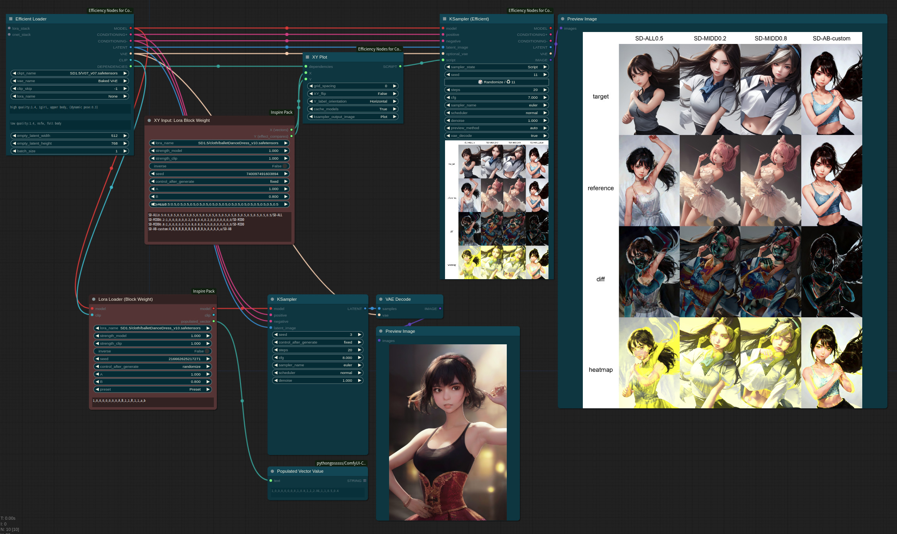

# Lora Block Weight

* Lora Block Weight is used to attenuate the influence of certain features in the model when loading LoRA, allowing you to reflect specific characteristics of LoRA. By blending multiple LoRAs using this node, you can mitigate the degradation in image quality.

* When using Lora Block Weight to partially block certain blocks within Lora, the effects can vary from one model to another. Therefore, it's necessary to analyze the effects using nodes like XYPlot and others.
(Note: To use this feature, update `Efficient Nodes` to a version released after September 3rd.)

* It is similar to [sd-webui-lora-block-weight](https://github.com/hako-mikan/sd-webui-lora-block-weight) but offers some modified features.
    * Instead of X, you can use two variables, A and B.
    * a and b are each half of the values of A and B, respectively.
    * U, u, R, and r are randomized values applied based on the seed. U and u are random values within the range of 0 to 3.0, while R and r are random values within the range of -1.5 to 1.5.
    
* The preset file is located under ComfyUI-Inspire-Pack/resources.
    * You can copy the `lbw-preset.custom.txt.example` file to `lbw-preset.custom.txt` and edit it to use custom user presets.
    * Note: Do not modify `lbw-preset.custom.txt.example` and `lbw-preset.txt`.

* The following image implements the functionality of the Effective Block Analyzer using an XY Plot. The "diff" row represents a visualization of the difference between two images, and the heatmap highlights areas of difference in yellow.

