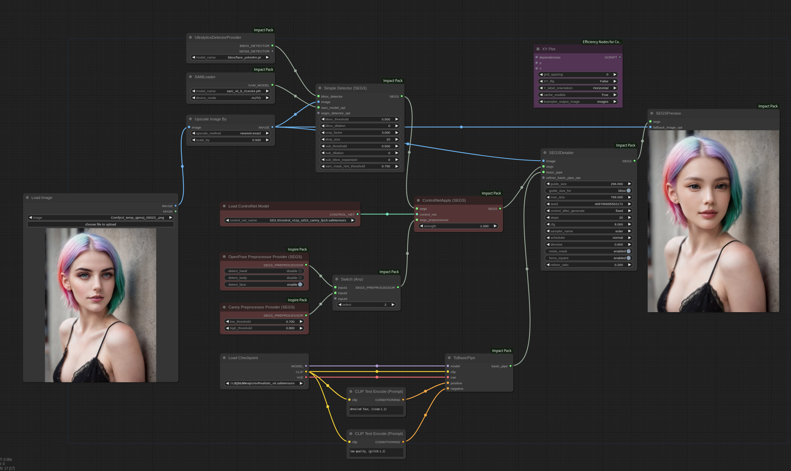

# SEGS ControlNet

This tutorial is provided as [Tutorial Video](
https://www.youtube.com/watch?v=RoWzBo9I0MQ).

* When applying ApplyControlNet in SEGS, you can configure the preprocessor using the Preprocessor Provider from the Inspire Pack.
The following example demonstrates how to maintain consistency in facial expressions using ControlNet.

