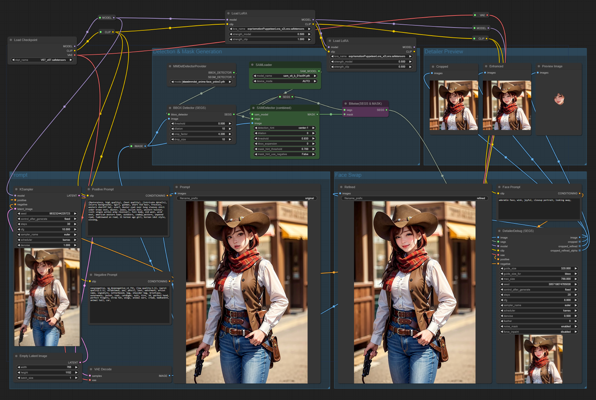
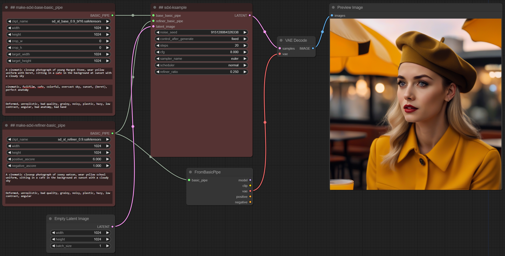
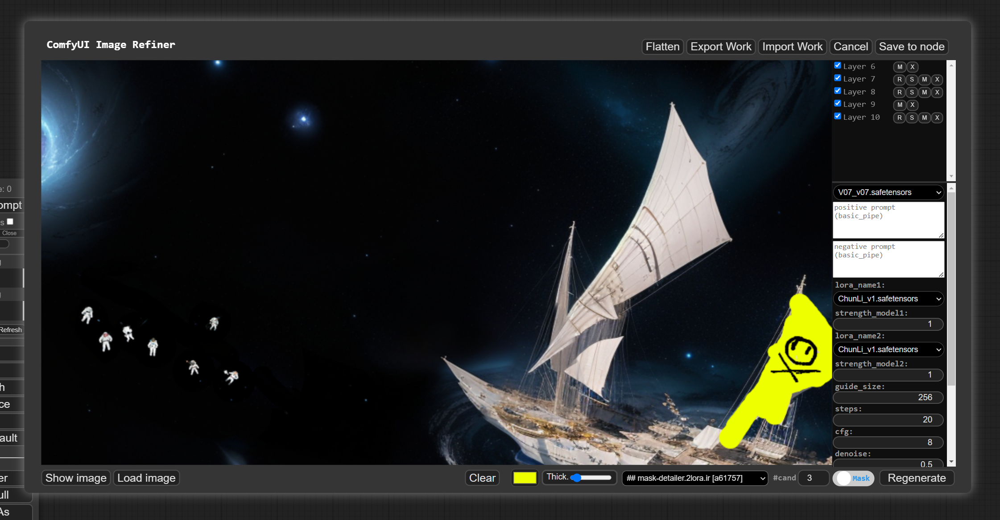

# comfyUI-extension-tutorials

## [ComfyUI-Impact-Pack](https://github.com/ltdrdata/ComfyUI-Impact-Pack)

ComfyUI-Impact-Pack provides various features such as detection, detailler, sender/receiver, etc., to enhance the workflow configuration of ComfyUI.

* [Images](ComfyUI-Impact-Pack/workflow) contains workflows for ComfyUI.
* You can download various [workflows](ComfyUI-Impact-Pack/workflow) for ComfyUI-Impact-Pack.
* Various tutorial videos are available on the [youtube playlist](https://www.youtube.com/playlist?list=PL_Ej2RDzjQLGfEeizq4GISeY3FtVyFmGP).  

* Tutorials
  * [Basic auto face detection and refine example](ComfyUI-Impact-Pack/tutorial/advanced.md)
  * [Combination with CLIPSeg](ComfyUI-Impact-Pack/tutorial/clipseg.md)
  * [Mask Pointer: Using the position prompt of SAM to mask](ComfyUI-Impact-Pack/tutorial/maskpointer.md)
  * [PreviewBridge: Nodes for supporting 'Clipspace' utilization](ComfyUI-Impact-Pack/tutorial/previewbridge.md)
  * [SAMDetection Application](ComfyUI-Impact-Pack/tutorial/SAM.md)
  * [Interactive SAM + PreviewBridge](ComfyUI-Impact-Pack/tutorial/sam_with_preview_bridge.md)
  * [Image Sender, Image Receiver, Latent Sender Latent Receiver](ComfyUI-Impact-Pack/tutorial/sender_receiver.md)
  * [TwoSamplersForMask](ComfyUI-Impact-Pack/tutorial/TwoSamplers.md)
  * [Advanced Iterative Upscale (TwoSamplersUpscaleProvider, KSampleProvider, TiledKSampleProvider)](ComfyUI-Impact-Pack/tutorial/TwoSamplersUpscale.md)
  * [PK_HOOK (Pixel KSample Hook)](ComfyUI-Impact-Pack/tutorial/pk_hook.md)
  * [TwoAdvancedSamplersForMask](ComfyUI-Impact-Pack/tutorial/TwoAdvancedSamplers.md)
  * [Extreme Highresolution Upscale](ComfyUI-Impact-Pack/tutorial/extreme-upscale.md)
  * [ImpactWildcardProcessor](ComfyUI-Impact-Pack/tutorial/ImpactWildcardProcessor.md)
  * [Batching images with detailer example](ComfyUI-Impact-Pack/tutorial/batching-detailer.md)

* Workflows
  * [Hair restyling](ComfyUI-Impact-Pack/workflow/hair-restyle.json) [[Demo video](https://www.youtube.com/watch?v=fsNBASZYDuA)]

## [ComfyUI-Workflow-Component](https://github.com/ltdrdata/ComfyUI-Workflow-Component)

ComfyUI-Workflow-Component provides functionality to simplify workflows by turning them into components, as well as an Image Refiner feature that allows improving images based on components.

* [Images](ComfyUI-Workflow-Component/workflow) contains workflows for ComfyUI.
* You can download various [workflows](ComfyUI-Workflow-Component/workflow) for ComfyUI-Workflow-Component.
* Various tutorial videos are available on the [youtube playlist](https://www.youtube.com/playlist?list=PL_Ej2RDzjQLE2Ma9dX0G4OYLrrBve53UV).  
